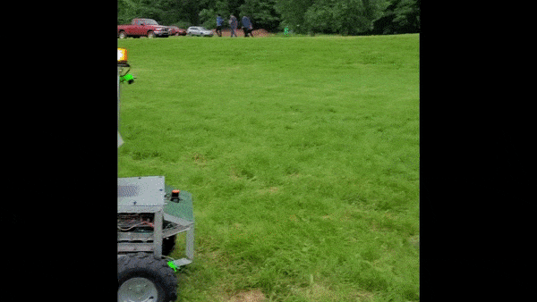
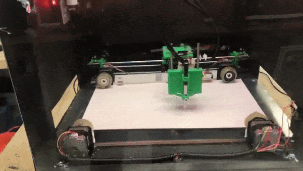

<h1 align='center'> Hello there! I'm Nnamdi 👋</h1>

 I'm a computer science student who also runs my <a href="https://github.com/waynerobotics">University's Robotics Club</a>. I am deeply interesting in robotics, embedded systems, computer vision, control systems, and electronics. I have built multiple autonomous ground robots, a pneumatically actuated exoskeloton, and a bunch of other interesting things. Feel free to checkout some of the work I have done on my <a href="https://mr-monwe.github.io/">website</a>.
  
🔭 Currently working : An autonomous robot, <a href="https://github.com/waynerobotics/veronica">Veronica</a>
 

<h2 align="center" style="font-family:'Roboto mono'"> Some of my past work</h2>

  

     
      
  

  
<!-- **Mr-Monwe/Mr-Monwe** is a ✨ _special_ ✨ repository because its `README.md` (this file) appears on your GitHub profile.

Here are some ideas to get you started:

- 🔭 I’m currently working on ...
- 🌱 I’m currently learning ...
- 👯 I’m looking to collaborate on ...
- 🤔 I’m looking for help with ...
- 💬 Ask me about ...
- 📫 How to reach me: ...
- 😄 Pronouns: ...
- ⚡ Fun fact: ...
-->
